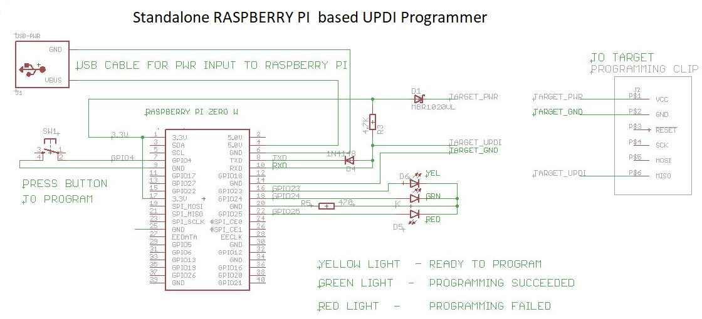
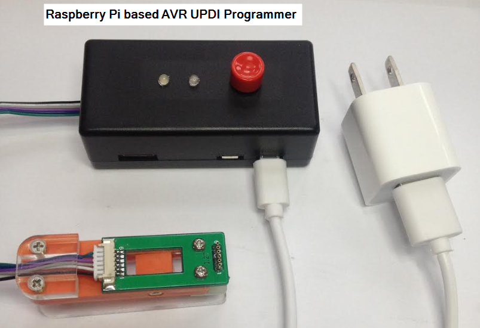
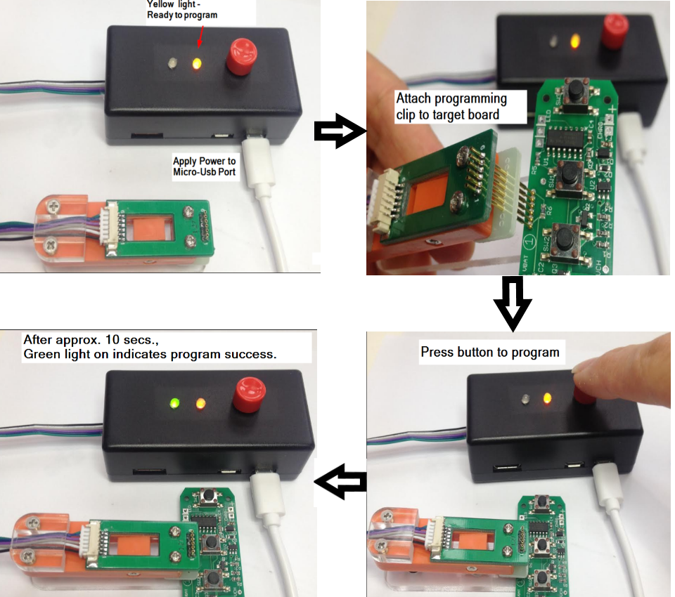

# Raspberry-Pi-UPDI-Stand-Alone-Programmer

This programmer is based on Python UPDI code :

    https://github.com/mraardvark/pyupdi.git

Changes were made to the hardware interface as well as the Python code in order to run on Raspberry Pi Zero.

PYUPDI Adaptation for Raspberry PI Zero W

#Usage:

0.  Power-up the Raspberry PI Programmer (USB Power connection)
1.  Programmer provides power to Target board.  
2.  Programmer has WiFi.  Use WINSCP to login to Programmer and place hex file in programming directory.
3.  Reboot the Programmer.  Within 30 seconds, Yellow comes on -> Ready for Use.
4.  Press Program button to program.  Within 10-15 seconds, Green light will lit - signals programming success.  
5.  Red light indicates programming failed.

